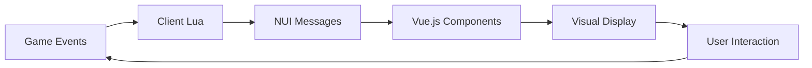

<div align="center">

# 🎮 JG-HUD

### 🚗 **Modern and Customizable HUD for FiveM**

*A sleek, performance-optimized HUD system built with Vue.js that provides essential player and vehicle information with a modern interface.*


[](LICENSE)
[](https://fivem.net/)
[](https://vuejs.org/)
[](#-framework-compatibility)
[](#-voice-chat-integration)

---

</div>

## ✨ Features

### 🎮 Player Information
- **Health & Armor**: Visual indicators with smooth animations
- **Hunger & Thirst**: Real-time status bars
- **Stamina**: Dynamic display when active
- **Money**: Cash and bank balance display
- **Job Information**: Current job and grade
- **Player ID**: Server identification
- **Voice Chat**: Level indicator and talking status
- **Real-time Clock**: Automatic time synchronization

### 🚗 Vehicle HUD
- **Speedometer**: Accurate speed display with customizable units
- **RPM Gauge**: Engine RPM with visual feedback
- **Fuel Level**: Fuel percentage with low fuel warnings
- **Engine Health**: Real-time engine condition monitoring
- **Odometer**: Distance tracking
- **Gear Indicator**: Current gear display (P, R, N, 1-6)
- **Turn Signals**: Left/right indicators with animations
- **Vehicle Lights**: Short lights, high beams status
- **Seatbelt Warning**: Visual and animated alerts
- **Handbrake Indicator**: Parking brake status
- **Engine Warning**: Critical engine alerts
- **Vehicle Damage**: Broken vehicle indicator

### 🗺️ Location System
- **Street Names**: Current street display
- **Zone Information**: Area/district names
- **Coordinates**: Real-time position tracking
- **Distance Calculation**: Travel distance monitoring

## 🔧 Framework Compatibility

### ✅ Supported Frameworks
- **ESX Legacy** - Full compatibility
- **QBCore** - Full compatibility  
- **QBOX** - Full compatibility

### 🎯 Voice Chat Integration
- **pma-voice** - Complete integration with level and talking detection
- **saltychat** - Compatible (with minor adjustments)
- **tokovoip** - Compatible (with minor adjustments)

## 📦 Installation

<details>
<summary><strong>🚀 Quick Setup Guide</strong></summary>

### Step 1: Download
```bash
# Clone the repository
git clone https://github.com/JG-Scripts/jg-hud.git

# Or download and extract to your resources folder
```

### Step 2: Add to Server
Add this line to your `server.cfg`:
```cfg
ensure jg-hud
```

### Step 3: Framework Detection
✅ **Automatic Detection** - No configuration needed!
- ESX Legacy ✓
- QBCore ✓
- QBOX ✓

### Step 4: Dependencies
| Resource | Status | Notes |
|----------|--------|---------|
| Framework (ESX/QB/QBOX) | **Required** | Auto-detected |
| pma-voice | **Recommended** | For voice features |

</details>

## ⚙️ Configuration

<div align="center">

🎯 **Plug & Play Ready!**

*The HUD works out of the box with default settings.*

*No additional configuration required for basic functionality.*

</div>

## 📱 Responsive Design

<table align="center">
<tr>
<th>Resolution</th>
<th>Status</th>
<th>Experience</th>
</tr>
<tr>
<td><strong>1920x1080</strong></td>
<td>🟢 Optimal</td>
<td>Perfect scaling and positioning</td>
</tr>
<tr>
<td><strong>2560x1440</strong></td>
<td>🟢 Excellent</td>
<td>Scaled appropriately</td>
</tr>
<tr>
<td><strong>Ultrawide</strong></td>
<td>🟡 Good</td>
<td>Positioned correctly</td>
</tr>
<tr>
<td><strong>Lower Res</strong></td>
<td>🟡 Good</td>
<td>Maintains readability</td>
</tr>
</table>

## 🔄 Data Flow

<div align="center">



</div>

## 🐛 Troubleshooting

<details>
<summary><strong>🔧 Common Issues & Solutions</strong></summary>

### 🚫 HUD Not Showing
- ✅ Ensure resource starts **after** your framework
- ✅ Check console for JavaScript errors
- ✅ Verify NUI is enabled

### 🚗 Vehicle Data Issues
- ✅ Confirm player is in vehicle
- ✅ Verify vehicle entity exists
- ✅ Check framework integration

### 🎤 Voice Problems
- ✅ Confirm **pma-voice** is running
- ✅ Check voice mode configuration
- ✅ Verify event handlers are registered

### 🐞 Debug Mode
Enable in `client/main.lua`:
```lua
local debugMode = true
```

</details>

## 🤝 Contributing

<div align="center">

**We welcome contributions from the community!**

</div>

<details>
<summary><strong>🛠️ Development Guide</strong></summary>

### Quick Start
1. 🍴 Fork the repository
2. 🌿 Create a feature branch
3. ✏️ Make your changes
4. 🧪 Test thoroughly
5. 📤 Submit a pull request

### Development Setup
```bash
# Install dependencies
cd vue-hud
npm install

# Development mode with hot reload
npm run dev

# Build for production
npm run build
```

</details>

---

## 📄 License

<div align="center">

[](LICENSE)

**This project is licensed under the MIT License**

*See the [LICENSE](LICENSE) file for details*

</div>

---

## 🙏 Credits

<div align="center">

| Technology | Purpose | Link |
|------------|---------|------|
| **Vue.js** | Frontend Framework | [🔗](https://vuejs.org/) |
| **Vite** | Build Tool | [🔗](https://vitejs.dev/) |
| **Tailwind CSS** | Styling Framework | [🔗](https://tailwindcss.com/) |
| **FiveM Community** | Inspiration & Support | [🔗](https://fivem.net/) |

</div>

## 📞 Support

<div align="center">

### 🆘 **Need Help?**

| Platform | Purpose | Link |
|----------|---------|------|
| 💬 **Discord** | Community Support | [Join Server](https://discord.gg/yourserver) |
| 🐛 **GitHub Issues** | Bug Reports & Features | [Report Issue](https://github.com/JG-Scripts/jg-hud/issues) |
| 📚 **Documentation** | Guides & Tutorials | [Read Wiki](https://github.com/JG-Scripts/jg-hud/wiki) |

</div>

---

<div align="center">

### 💖 **Made with Love for the FiveM Community**


**🎮 Compatible with ESX Legacy, QBCore, and QBOX frameworks 🎮**

*Thank you for choosing JG-HUD! ⭐*

---

**© 2025 JG-Scripts | Built with Vue.js & ❤️**

</div>